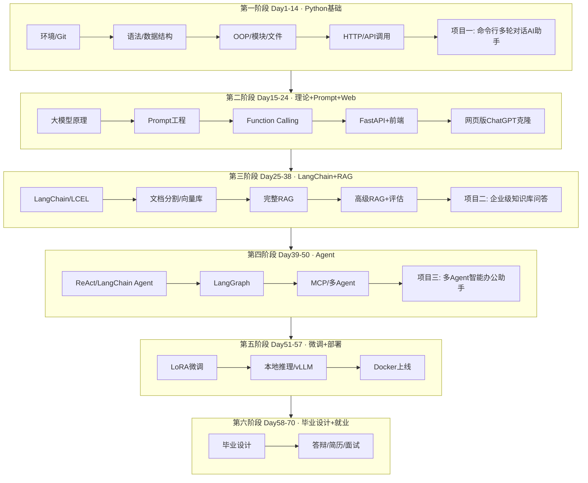

# 零基础大模型应用开发 · 70 天培训课程总路线图

> **版本**：v1.0  
> **适用对象**：零编程基础或仅有少量基础的转行者、在校生、产品经理  
> **每日结构**：上午授课 → 下午实操 → 晚自习答疑/作业  
> **课件规范**：每天独立目录 `courseware/dayXX/`，配套代码 `code/dayXX/`

---

## 一、课程全局架构图



---

## 二、四大学位能力与企业级项目对照表

| 阶段 | 天数 | 核心能力 | 企业级落地项目 | 简历关键词 |
|------|------|----------|----------------|------------|
| 一 | 1-14 | Python + API 调用 | 命令行多轮对话 AI 助手 | Python、JSON、REST |
| 二 | 15-24 | Prompt + Web 全栈雏形 | 网页版 ChatGPT 克隆（流式） | FastAPI、SSE、Prompt |
| 三 | 25-38 | RAG 检索增强生成 | 企业级知识库问答系统 | LangChain、向量库、Rerank |
| 四 | 39-50 | Agent 智能体编排 | 多 Agent 智能办公助手 | LangGraph、MCP、Tool Use |
| 五 | 51-57 | 微调与工程部署 | 垂直领域微调模型 + 容器化上线 | LoRA、Docker、vLLM |
| 六 | 58-70 | 综合毕业设计 | 自选方向完整产品 | 全栈大模型应用 |

---

## 三、每日课件目录规范（与 SVM 参考课件同构）

每一天的 `courseware/dayXX/` 必须包含：

```
dayXX/
├── DayXX-主题名.md          # 主课件（≥30000字）
├── 需求文档.md               # 当日实操项目 PRD
├── 架构设计.md               # 模块/数据流/接口设计
├── 流程图与示意图.md         # Mermaid + ASCII 图
├── 课堂笔记精华.md           # 可打印一页纸总结
├── 作业与标准答案.md         # 作业题 + 完整参考答案
└── 旁白导读.md               # 承上启下、学习心态、常见误区
```

配套代码目录 `code/dayXX/`：

```
dayXX/
├── README.md                 # 运行说明
├── requirements.txt
├── src/                      # 源码（全注释）
├── tests/                    # 可选单测
└── docs/                     # 补充说明
```

---

## 四、70 天日课索引（点击对应目录开始学习）

| Day | 主题 | 课件目录 | 阶段项目节点 |
|-----|------|----------|--------------|
| 01 | 开发环境与第一行代码 | [day01](./day01/) | — |
| 02 | 运算符与字符串 | day02 | — |
| 03 | 流程控制 | day03 | — |
| 04 | 核心数据结构(上) | day04 | — |
| 05 | 核心数据结构(下)·字典与JSON | day05 | — |
| 06 | 函数 | day06 | — |
| 07 | 第一周复习与周测 | day07 | 通讯录管理系统 |
| 08 | 面向对象(上) | day08 | — |
| 09 | 面向对象(下) | day09 | — |
| 10 | 模块包与异常 | day10 | — |
| 11 | 文件操作与标准库 | day11 | — |
| 12 | 网络请求与 API 调用 | day12 | 首次 LLM API |
| 13 | 装饰器与异步入门 | day13 | — |
| 14 | 阶段项目一 | day14 | **命令行多轮对话 AI 助手** |
| 15-70 | … | day15-day70 | 见各日目录 |

> **说明**：Day 02 起将按相同规范逐日发布；当前仓库已完整交付 **Day 01** 全套课件与代码。

---

## 五、累计代码量规划（目标 20 万行）

| 阶段 | 预估行数 | 主要构成 |
|------|----------|----------|
| Python 基础 | ~8,000 | 每日小项目 + 阶段项目一 ~2,000 行 |
| Prompt + Web | ~15,000 | API 封装、FastAPI、前端 |
| RAG | ~45,000 | 文档管道、检索、评估、项目二 |
| Agent | ~55,000 | 工具、图编排、项目三 |
| 微调部署 | ~25,000 | 训练脚本、推理服务、Docker |
| 毕业设计 | ~52,000 | 学员个性化 + 课程模板代码 |
| **合计** | **~200,000** | 含注释、测试、配置 |

---

## 六、学习路径旁白（给零基础学员的一段话）

你不需要先成为「计算机专家」再学大模型。这门课的设计逻辑是：**每天用一个小成果托住你的信心，每个周末用一个小项目锁住你的技能，每个阶段用一个能写进简历的企业级作品证明你真的会了。**

Day 1 看起来只是在屏幕上打印一行字——但那一行字背后，是你第一次命令计算机按你的意图工作。70 天后回头看，你会发现那一行 `print("Hello, AI Developer")` 和所有 RAG、Agent 代码用的是同一门语言、同一种思维方式。

我们从 Day 1 开始，一天都不跳。
