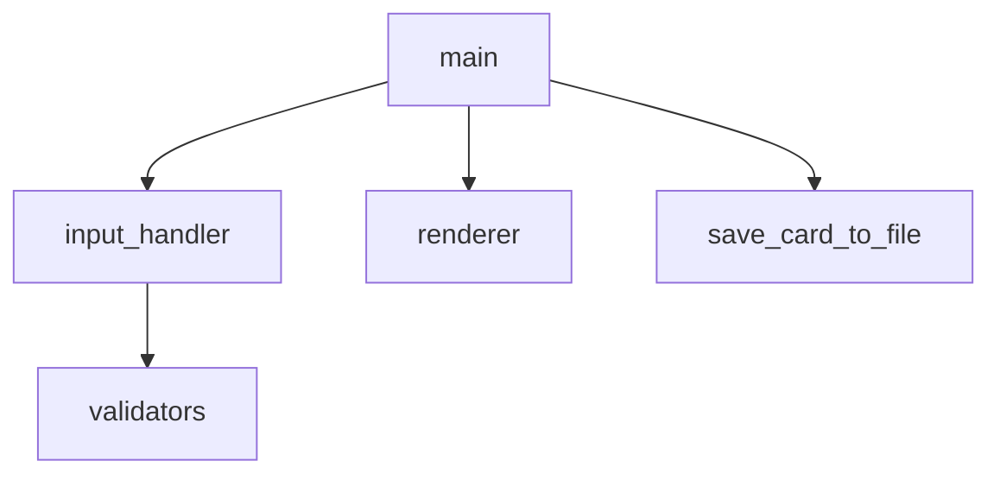

# Day 1 课后作业与标准答案

> **提交方式**：代码作业 push 至 `code/day01/homework/学号或姓名/`；书面作业可 Markdown 或拍照  
> **批改标准**：能运行 > 注释清晰 > 扩展创新

---

## 作业 1（基础）：环境验收截图说明

**题目**：在本地完成环境验收，并文字回答以下问题（各 1-2 句）：

1. 你的 Python 版本号是多少？
2. 你使用的操作系统是什么？
3. VS Code 中选择的 Python 解释器路径大致是什么？
4. 运行 `hello.py` 的输出是什么？

**标准答案（示例，请替换为你自己的真实信息）**：

1. `Python 3.11.9`
2. `Windows 11` / `macOS 14` / `Ubuntu 22.04`
3. `C:\Users\xxx\AppData\Local\Programs\Python\Python311\python.exe` 或 `/usr/bin/python3.11`
4. 两行：`Hello, AI Developer` 与 `环境配置成功，可以开始 70 天旅程。`

**评分要点**：版本 ≥3.10；描述具体，非复制他人。

---

## 作业 2（基础）：变量与类型

**题目**：编写 `homework_02_types.py`，完成：

1. 定义变量：`course_name`（str）、`total_days`（int）、`hours_per_day`（float）、`is_beginner`（bool）
2. 用 f-string 打印一句自我介绍，包含以上四个变量
3. 用 `type()` 打印四个变量的类型

**标准答案**：

```python
# homework_02_types.py
course_name = "零基础大模型应用开发"
total_days = 70
hours_per_day = 7.5
is_beginner = True

print(
    f"我报名了《{course_name}》，共 {total_days} 天，"
    f"每天约 {hours_per_day} 小时，零基础学员：{is_beginner}"
)

print(type(course_name))   # <class 'str'>
print(type(total_days))    # <class 'int'>
print(type(hours_per_day)) # <class 'float'>
print(type(is_beginner))   # <class 'bool'>
```

---

## 作业 3（基础）：input 与类型转换

**题目**：编写程序，询问用户「今年想完成的学习目标（字符串）」和「计划每天学习小时数（数字）」，若小时数不在 1-12 之间则提示重新输入，最后打印确认信息。

**标准答案**：

```python
# homework_03_input.py
goal = input("今年你的学习目标是什么？\n> ").strip()
while not goal:
    goal = input("目标不能为空，请重新输入：\n> ").strip()

while True:
    raw = input("计划每天学习几小时（1-12）？\n> ").strip()
    try:
        hours = float(raw)
        if 1 <= hours <= 12:
            break
    except ValueError:
        pass
    print("请输入 1 到 12 之间的数字。")

print(f"\n已记录：你每天学 {hours} 小时，目标 —— {goal}")
```

**说明**：今日学了 `isdigit()`，浮点数可用 `try/except`（Day 10 详解）或 `float()` 判断。

---

## 作业 4（核心）：独立完成个人信息卡片 MVP

**题目**：不复制粘贴企业版代码，凭记忆写出 `mvp_card.py` 同等功能（含年龄校验），运行截图或终端文字提交。

**标准答案**：见仓库 `code/day01/mvp_card.py`。讲师批改时重点看：**是否有 while 校验年龄**、**是否使用 f-string**。

---

## 作业 5（核心）：阅读企业版代码

**题目**：阅读 `src/` 下五个文件，手绘或 Mermaid 画出模块调用关系，并回答：

1. `main.py` 调用了哪些模块的哪些函数？
2. 如果把边框字符从 `═` 改成 `-`，应改哪个文件？

**标准答案**：

1. `main.py` → `prompt_profile()`（input_handler）→ 各 `prompt_*` → validators；`print_card` / `render_card`（renderer）；`save_card_to_file`（main 内）；`ask_yes_no`（main 内）。
2. 主要改 `renderer.py` 中 `render_card` 内的边框字符；若多处引用可再抽到 `config.py`（扩展思考）。



---

## 作业 6（进阶）：扩展名片宽度

**题目**：修改 `config.py` 中 `CARD_WIDTH = 50`，观察输出变化。写 50 字说明：宽度变大后，哪一行代码负责防止文字溢出？

**标准答案**：

`renderer.py` 的 `content_line` 函数（`render_card` 内部）根据 `width - 4` 计算 `inner_width`，超长时截断并加 `…`。宽度越大，单行可容纳字符越多，座右铭折行次数可能减少。

---

## 作业 7（进阶）：Git 实操

**题目**：完成以下操作并粘贴终端历史（可打码用户名）：

```bash
git init
git add .
git commit -m "Day1: 完成作业4个人信息卡片"
git remote add origin <你的仓库>
git push -u origin main
```

**标准答案要点**：

- 首次 push 可能要求 GitHub 登录或 Personal Access Token
- `commit message` 应语义清晰
- 仓库中不应出现真实 API Key（今日虽无 Key，养成习惯）

**常见错误**：

| 报错 | 处理 |
|------|------|
| `fatal: not a git repository` | 先 `git init` |
| `failed to push some refs` | 先 `git pull --rebase` 再 push |
| `support for password authentication was removed` | 使用 PAT 或 SSH |

---

## 作业 8（选修）：预习 JSON 导出

**题目**：在名片生成后，将 `profile` 字典写入 `output/profile.json`（提示：预习 `import json` 与 `json.dump`）。

**标准答案**：

```python
import json
from pathlib import Path

def save_profile_json(profile: dict, path: Path) -> None:
    path.parent.mkdir(parents=True, exist_ok=True)
    with path.open("w", encoding="utf-8") as f:
        json.dump(profile, f, ensure_ascii=False, indent=2)

# 在 main 末尾调用：
# save_profile_json(profile, Path("output/profile.json"))
```

**旁白**：这与 Day 5 内容一致，选做者 Day 5 会轻松很多。

---

## 面试预热题标准答案

1. **Python 是编译型还是解释型？**  
   主流 CPython 实现为解释型：源码由解释器逐行执行；也存在编译成字节码的中间步骤，但对外常称解释型语言。

2. **`input()` 返回什么类型？**  
   始终返回 `str`，即使用户输入的是数字。

3. **f-string 相比 `%` 格式化有什么优势？**  
   可读性更好、变量直接嵌入、支持格式说明符如 `{x:.2f}`，Python 3.6+ 推荐写法。

4. **为什么企业项目要求 UTF-8？**  
   跨平台统一编码，正确显示中文，避免 JSON/API 交互乱码。

5. **Git 中 add、commit、push 分别做什么？**  
   `add` 暂存区；`commit` 本地快照；`push` 上传到远程仓库。

---

## 作业提交清单

- [ ] homework_02_types.py
- [ ] homework_03_input.py
- [ ] mvp_card.py 或同等
- [ ] 模块关系图（作业 5）
- [ ] Git 仓库链接
- [ ] （选修）profile.json 导出

**明日上课前**：复习字符串，预习 `split` 与 `strip`。
