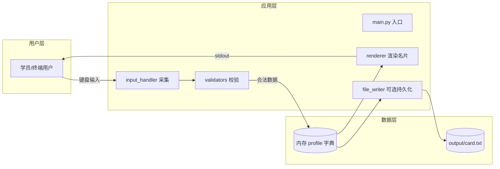
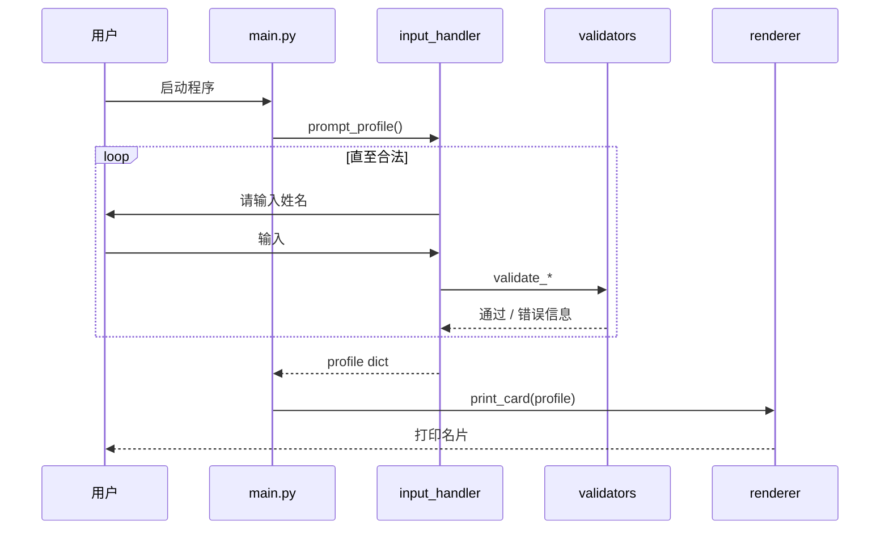

# Day 1 架构设计说明

## 1. 设计范围

Day 1 不涉及网络、数据库与框架。架构指 **单进程命令行应用** 的模块划分与数据流，为 Day 10「多文件包结构」和 Day 14「阶段项目一」打基础。

---

## 2. 逻辑架构图



---

## 3. 目录结构（企业级雏形）

```
code/day01/
├── README.md
├── requirements.txt          # 空或仅注释，Day1 无第三方依赖
├── src/
│   ├── __init__.py
│   ├── main.py               # 程序入口
│   ├── input_handler.py      # 交互采集
│   ├── validators.py         # 输入校验
│   ├── renderer.py           # 名片渲染
│   └── config.py             # 常量：边框宽度、文件路径
├── output/                   # 运行时生成，加入 .gitignore
│   └── card.txt
└── tests/
    └── test_validators.py    # 可选
```

**设计原则**：

- **单一职责**：采集、校验、展示分离，Day 6 函数课会回顾「为什么要拆」
- **配置外置**：边框宽度写在 `config.py`，改 UI 不动业务逻辑
- **可测试**：`validators.py` 纯函数，不依赖 `input()`

---

## 4. 模块接口设计

### 4.1 `validators.py`

```python
def validate_non_empty(value: str, field_name: str) -> str:
    """非空校验，空则抛 ValueError 或返回错误消息（实现二选一，课件用返回元组）"""

def validate_age(raw: str) -> int:
    """将字符串转为 int，范围建议 1-120"""
```

### 4.2 `input_handler.py`

```python
def prompt_profile() -> dict:
    """循环提问直至合法，返回 profile 字典"""
```

### 4.3 `renderer.py`

```python
def render_card(profile: dict, width: int = 40) -> str:
    """返回完整名片字符串，不直接 print"""

def print_card(profile: dict) -> None:
    """调用 render_card 并输出"""
```

### 4.4 `main.py`

```python
def main() -> None:
    ...

if __name__ == "__main__":
    main()
```

---

## 5. 数据流时序



---

## 6. 与 70 天课程的技术演进关系

| Day 1 概念 | 后续升级点 |
|------------|------------|
| `dict` 存 profile | Day 5 JSON 序列化；Day 8 `ChatMessage` 类 |
| `input()` 交互 | Day 12 `requests` 调 API；Day 23 FastAPI 接 HTTP |
| 函数拆分 | Day 10 包结构；Day 14 多轮对话状态机 |
| 文件写入 | Day 11 批量文档；Day 14 对话历史 JSON 持久化 |
| UTF-8 编码 | Day 28 PDF 加载；RAG 中文分块 |

---

## 7. 错误处理策略（Day 1 级别）

- 校验失败：**就地重试**，不终止程序
- 文件写入失败：打印警告，名片仍显示在屏幕
- 不使用 `try/except` 包一切（Day 10 系统学习），今日仅在写文件处示范

---

**架构版本**：v1.0 · 随 Day 10 重构为多包工程
