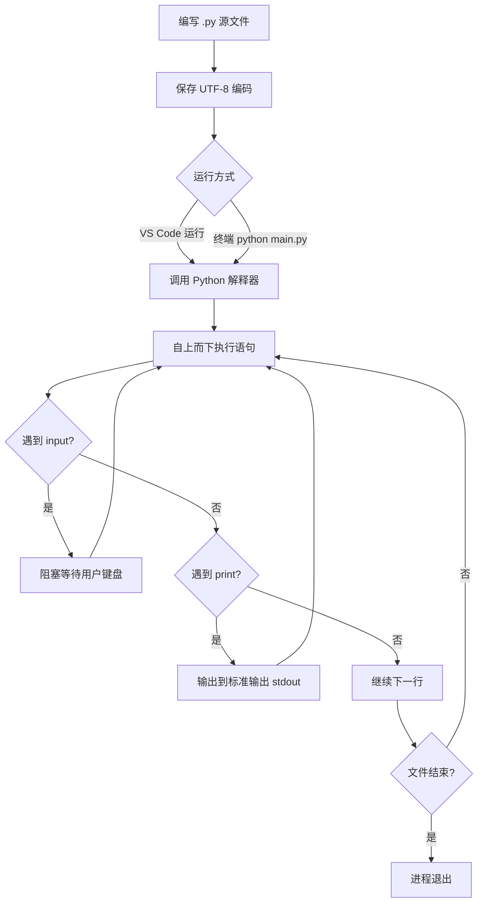
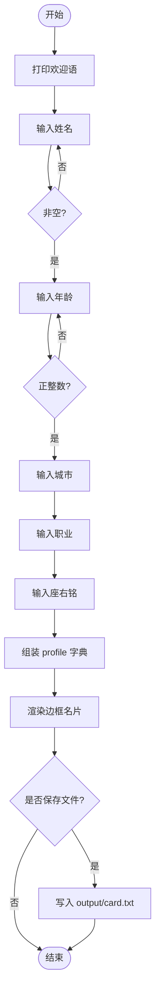
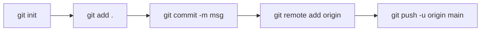

# Day 1 流程图与示意图汇编

---

## 1. 今日学习时间轴（9:00 - 21:00）

```mermaid
gantt
    title Day 1 学习时间轴
    dateFormat HH:mm
    axisFormat %H:%M

    section 上午
    课程介绍与行业全景     :09:00, 90m
    环境安装 Python/VSCode :10:30, 90m

    section 下午
    变量与数据类型         :14:00, 90m
    个人信息卡片实操       :15:30, 120m

    section 晚自习
    Git/GitHub 实操        :19:00, 120m
```



---

## 2. 大模型应用开发职业路径示意图

```
                    ┌─────────────────────────────────────┐
                    │     大模型应用开发职业生态           │
                    └─────────────────────────────────────┘
                                      │
          ┌───────────────────────────┼───────────────────────────┐
          ▼                           ▼                           ▼
   ┌──────────────┐           ┌──────────────┐           ┌──────────────┐
   │  应用开发岗   │           │  算法工程岗   │           │  产品/实施岗  │
   │ Prompt/RAG   │           │ 微调/推理优化 │           │ 需求/落地     │
   │ Agent 编排   │           │ 训练数据     │           │ 客户交付      │
   └──────┬───────┘           └──────┬───────┘           └──────┬───────┘
          │                          │                          │
          └──────────────────────────┼──────────────────────────┘
                                     ▼
                    ┌─────────────────────────────────────┐
                    │  共同底座：Python + API + 工程化      │
                    │  ← 本课程 Day 1-14 正在筑基          │
                    └─────────────────────────────────────┘
```

---

## 3. Python 程序执行流程（第一个程序）



---

## 4. 个人信息卡片业务流程



---

## 5. 开发环境组件关系图

```
┌─────────────────────────────────────────────────────────────┐
│                        你的电脑                              │
│  ┌─────────────┐    ┌─────────────┐    ┌─────────────────┐  │
│  │   VS Code   │───▶│   Python    │───▶│  你的 .py 程序   │  │
│  │  编辑器/IDE  │    │  3.10+ 解释器│    │  day01/src/...  │  │
│  └─────────────┘    └─────────────┘    └─────────────────┘  │
│         │                  │                    │            │
│         │                  ▼                    ▼            │
│         │           ┌─────────────┐      ┌─────────────┐      │
│         └──────────▶│  集成终端    │      │ output/     │      │
│                     │  Terminal   │      │ 运行产物     │      │
│                     └─────────────┘      └─────────────┘      │
│  ┌─────────────┐                                              │
│  │ Git + GitHub│  ← 晚自习：代码版本管理与备份                  │
│  └─────────────┘                                              │
└─────────────────────────────────────────────────────────────┘
```

---

## 6. 四种基本数据类型关系（Day 1 认知版）

```
                    Python 基本类型（今日四类）
                              │
        ┌──────────┬──────────┼──────────┬──────────┐
        ▼          ▼          ▼          ▼          ▼
      int        float       str        bool      (后续)
     整数        浮点数      字符串      布尔
      28         3.14      "上海"      True
        │          │          │          │
        └──────────┴──────────┴──────────┘
                         │
              日后 API JSON 中的值类型
              {"age": 28, "city": "上海", "ok": true}
```

---

## 7. Git 首次提交工作流（晚自习）



---

**图示版本**：Day 1 · 与主课件同步
