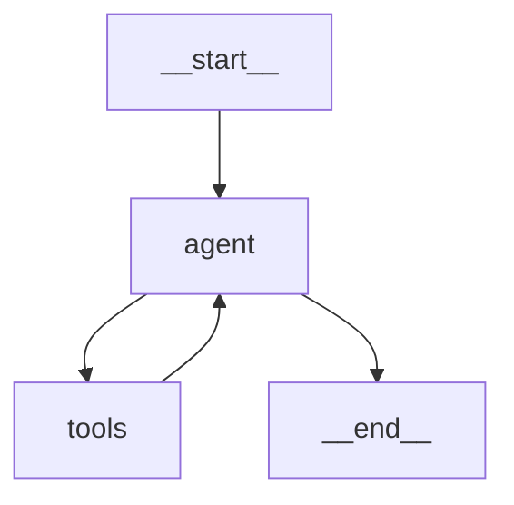

# Day 41: LangGraph 入门

> **培训阶段**: 第四阶段 Agent 开发 | **第 7 周** | **学习时长**: 约 6-8 小时  
> **今日关键词**: LangGraph、StateGraph、节点、边、状态、条件路由

---

## 📍 课程导航

### 上节回顾

**Day 40** 你用 LangChain 的 `create_react_agent` + `AgentExecutor` 构建了研究助手 Agent，体验了 `@tool` 装饰器、Prompt Hub 和内置工具生态。AgentExecutor 适合线性 ReAct 循环，但面对**条件分支、并行执行、人工介入、持久化状态**等复杂需求时显得力不从心——这正是 LangGraph 要解决的问题。

**Day 40 核心收获回顾：**
- `@tool` + `create_react_agent` + `AgentExecutor` 三件套
- `handle_parsing_errors` 和 `max_iterations` 控制
- 工具 docstring 决定 Agent 工具选择准确率

### 本节学习目标

完成本日学习后，你将能够：

1. 理解 LangGraph 的设计动机：从 Chain 到 Graph 的演进
2. 掌握 StateGraph 核心概念：State、Node、Edge、Conditional Edge
3. 用 LangGraph 实现一个完整的 ReAct Agent
4. 使用 `graph.get_graph().draw_mermaid_png()` 可视化 Agent 流程
5. 理解 `MessagesState` 和 TypedDict 状态定义
6. 为 Day 42 的高级特性（检查点、子图、并行）打下基础

### 与后续课程的衔接

- **Day 42** 将学习检查点（Checkpoint）、持久化、流式输出和人机协作（Human-in-the-loop）
- **Day 43** 多 Agent 系统本质上是多个 LangGraph 子图的编排
- **Day 46** Agent 工程化将用 LangGraph 实现重试、熔断、监控
- **Day 48** 阶段项目三推荐使用 LangGraph 作为 Agent 编排引擎

---

## 🌅 上午课程（9:00 - 12:00）

### 9:00 - 9:45 | 模块一：为什么需要 LangGraph？

#### 1.1 AgentExecutor 的局限

```
AgentExecutor 内部逻辑（简化）：

while not done and iterations < max:
    llm_output = call_llm()
    if "Final Answer" in llm_output:
        done = True
    else:
        tool_result = execute_tool()
        append_to_history(tool_result)

问题：
❌ 流程是固定的线性循环，无法插入自定义步骤
❌ 无法做条件分支（如：搜索结果不满意 → 换策略重搜）
❌ 无法并行执行多个工具
❌ 无法在中间步骤暂停等待人工确认
❌ 状态管理不透明，难以调试和持久化
```

#### 1.2 LangGraph 的核心思想

> LangGraph 将 Agent 工作流建模为**有向图**：每个**节点**是一个处理步骤，**边**定义步骤间的流转规则。

```
              ┌──────────┐
              │  START   │
              └────┬─────┘
                   │
                   ▼
              ┌──────────┐
         ┌───►│  Agent   │  LLM 推理，决定下一步
         │    └────┬─────┘
         │         │
         │    需要工具？
         │    ┌────┴────┐
         │   是        否
         │    │         │
         │    ▼         ▼
         │ ┌──────┐ ┌──────────┐
         │ │ Tool │ │   END    │
         │ └──┬───┘ └──────────┘
         │    │
         │  观察结果
         └────┘  （循环回 Agent）
```

**LangGraph vs AgentExecutor：**

| 特性 | AgentExecutor | LangGraph |
|------|---------------|-----------|
| 流程控制 | 固定循环 | 任意图结构 |
| 条件分支 | ❌ | ✅ Conditional Edge |
| 并行执行 | ❌ | ✅ 多节点扇出 |
| 人工介入 | ❌ | ✅ interrupt |
| 状态持久化 | ❌ | ✅ Checkpoint |
| 可视化 | ❌ | ✅ Mermaid 图 |
| 学习曲线 | 低 | 中 |

#### 1.3 安装与 Hello World

```bash
pip install langgraph langchain-openai

# 验证
python -c "import langgraph; print('LangGraph ready')"
```

```python
# day41/hello_graph.py
"""LangGraph 最小示例：线性三节点"""
from typing import TypedDict
from langgraph.graph import StateGraph, START, END

# 1. 定义状态
class State(TypedDict):
    message: str
    step_count: int

# 2. 定义节点函数
def step_one(state: State) -> dict:
    return {"message": state["message"] + " → 步骤1", "step_count": 1}

def step_two(state: State) -> dict:
    return {"message": state["message"] + " → 步骤2", "step_count": 2}

def step_three(state: State) -> dict:
    return {"message": state["message"] + " → 完成!", "step_count": 3}

# 3. 构建图
graph = StateGraph(State)
graph.add_node("step_one", step_one)
graph.add_node("step_two", step_two)
graph.add_node("step_three", step_three)

# 4. 添加边（定义流转）
graph.add_edge(START, "step_one")
graph.add_edge("step_one", "step_two")
graph.add_edge("step_two", "step_three")
graph.add_edge("step_three", END)

# 5. 编译并运行
app = graph.compile()
result = app.invoke({"message": "开始", "step_count": 0})
print(result)
# {'message': '开始 → 步骤1 → 步骤2 → 完成!', 'step_count': 3}
```

---

### 9:45 - 10:30 | 模块二：StateGraph 核心 API

#### 2.1 状态（State）设计

```python
from typing import TypedDict, Annotated
from langgraph.graph.message import add_messages

# 方式 1：简单 TypedDict
class SimpleState(TypedDict):
    question: str
    answer: str
    iterations: int

# 方式 2：使用 Annotated 定义合并策略
class AgentState(TypedDict):
    messages: Annotated[list, add_messages]  # 消息列表自动追加
    current_step: int

# 方式 3：使用内置 MessagesState
from langgraph.graph import MessagesState
# MessagesState 等价于 {"messages": Annotated[list, add_messages]}
```

**`Annotated[list, add_messages]` 的作用：**

```python
# 普通 list：新值覆盖旧值
state["messages"] = [new_msg]  # 旧消息丢失！

# add_messages：新值追加到旧值
state["messages"] = [new_msg]  # 追加到已有消息列表
```

#### 2.2 节点（Node）

```python
def my_node(state: AgentState) -> dict:
    """
    节点函数规则：
    1. 接收当前 state 作为参数
    2. 返回 dict，包含要更新的字段
    3. 返回的 dict 会按合并策略更新 state
    4. 不要直接修改 state（保持不可变）
    """
    last_message = state["messages"][-1]
    response = f"处理了: {last_message.content}"
    return {"messages": [{"role": "assistant", "content": response}]}
```

#### 2.3 边（Edge）类型

```python
# 普通边：无条件流转
graph.add_edge("node_a", "node_b")

# 条件边：根据状态动态路由
def should_continue(state: AgentState) -> str:
    """路由函数：返回下一个节点名称"""
    last_msg = state["messages"][-1]
    if "最终答案" in last_msg.content:
        return "end"
    return "continue"

graph.add_conditional_edges(
    "agent",           # 源节点
    should_continue,   # 路由函数
    {
        "continue": "tools",   # 返回值 → 目标节点
        "end": END,
    }
)

# 入口和出口
graph.add_edge(START, "agent")
```

---

### 10:30 - 10:45 | 课间休息

---

### 10:45 - 12:00 | 模块三：LangGraph 实现 ReAct Agent

#### 3.1 完整 ReAct Agent 图

```python
# day41/react_graph.py
"""
Day 41: 用 LangGraph 实现 ReAct Agent
"""
import os
from typing import TypedDict, Annotated, Literal
from langchain_openai import ChatOpenAI
from langchain_core.tools import tool
from langchain_core.messages import HumanMessage, AIMessage, ToolMessage
from langgraph.graph import StateGraph, START, END, MessagesState
from langgraph.prebuilt import ToolNode

# ===== 工具 =====
@tool
def calculator(expression: str) -> str:
    """计算数学表达式。"""
    try:
        return str(eval(expression))
    except Exception as e:
        return f"错误: {e}"

@tool
def search_knowledge(query: str) -> str:
    """搜索知识库。"""
    kb = {"python": "Python 1991年发布", "agent": "Agent 能自主使用工具"}
    for k, v in kb.items():
        if k in query.lower():
            return v
    return f"未找到: {query}"

tools = [calculator, search_knowledge]
tools_by_name = {t.name: t for t in tools}

# ===== 模型（绑定工具） =====
llm = ChatOpenAI(
    model="deepseek-chat",
    api_key=os.getenv("DEEPSEEK_API_KEY"),
    base_url="https://api.deepseek.com",
    temperature=0,
)
llm_with_tools = llm.bind_tools(tools)

# ===== 节点定义 =====
def agent_node(state: MessagesState) -> dict:
    """Agent 节点：LLM 推理"""
    response = llm_with_tools.invoke(state["messages"])
    return {"messages": [response]}

# 使用预构建的 ToolNode（自动执行工具调用）
tool_node = ToolNode(tools)

# ===== 路由函数 =====
def should_continue(state: MessagesState) -> Literal["tools", "end"]:
    """判断是否需要调用工具"""
    last_message = state["messages"][-1]
    if last_message.tool_calls:
        return "tools"
    return "end"

# ===== 构建图 =====
graph = StateGraph(MessagesState)

graph.add_node("agent", agent_node)
graph.add_node("tools", tool_node)

graph.add_edge(START, "agent")
graph.add_conditional_edges("agent", should_continue, {"tools": "tools", "end": END})
graph.add_edge("tools", "agent")  # 工具执行完回到 Agent

# 编译
app = graph.compile()

# ===== 运行 =====
if __name__ == "__main__":
    result = app.invoke({
        "messages": [HumanMessage(content="计算 25 * 4 等于多少？")]
    })
    
    for msg in result["messages"]:
        if hasattr(msg, "content") and msg.content:
            print(f"[{msg.__class__.__name__}] {msg.content}")
```

#### 3.2 图可视化

```python
# 生成 Mermaid 图（可在 mermaid.live 查看）
try:
    png_bytes = app.get_graph().draw_mermaid_png()
    with open("day41/react_graph.png", "wb") as f:
        f.write(png_bytes)
    print("图已保存到 react_graph.png")
except Exception:
    # 如果没有安装 pygraphviz，打印 Mermaid 文本
    print(app.get_graph().draw_mermaid())
```

预期 Mermaid 输出：



#### 3.3 流式执行

```python
# 流式输出每个节点的执行结果
for event in app.stream(
    {"messages": [HumanMessage(content="Python 是什么？")]},
    stream_mode="updates",
):
    for node_name, update in event.items():
        print(f"节点 [{node_name}] 完成")
        if "messages" in update:
            last = update["messages"][-1]
            print(f"  → {last.content[:100] if last.content else last.tool_calls}")
```

---

## 🌇 下午实操（14:00 - 17:30）

### 14:00 - 15:30 | 实操项目：带路由的智能问答图

#### 项目需求

构建一个智能问答系统，根据问题类型路由到不同处理节点：

```
用户问题
    │
    ▼
┌──────────┐
│  分类器   │  判断问题类型
└────┬─────┘
     │
  ┌──┼──┬──────┐
  ▼  ▼  ▼      ▼
 计算 知识 搜索  闲聊
  │  │  │      │
  └──┴──┴──────┘
         │
         ▼
      最终回答
```

#### 参考代码

```python
# day41/smart_qa_graph.py
"""
智能问答路由图 - Day 41 下午项目
"""
import os
from typing import Literal
from langchain_openai import ChatOpenAI
from langchain_core.messages import HumanMessage, AIMessage, SystemMessage
from langchain_core.tools import tool
from langgraph.graph import StateGraph, START, END, MessagesState
from langgraph.prebuilt import ToolNode

llm = ChatOpenAI(
    model="deepseek-chat",
    api_key=os.getenv("DEEPSEEK_API_KEY"),
    base_url="https://api.deepseek.com",
    temperature=0,
)

# ===== 工具 =====
@tool
def calculator(expression: str) -> str:
    """计算数学表达式。"""
    return str(eval(expression))

@tool
def search_knowledge(query: str) -> str:
    """搜索课程知识库。"""
    kb = {"rag": "检索增强生成", "agent": "自主智能体", "langgraph": "图编排框架"}
    for k, v in kb.items():
        if k in query.lower():
            return f"{k}: {v}"
    return "未找到"

@tool
def web_search(query: str) -> str:
    """模拟网页搜索。"""
    return f"关于'{query}'的搜索结果：这是模拟数据。"

# ===== 分类节点 =====
def classify_node(state: MessagesState) -> dict:
    """分类用户问题"""
    question = state["messages"][-1].content
    classify_prompt = f"""判断以下问题的类型，只返回一个类别：
- math: 数学计算
- knowledge: 知识查询
- search: 需要实时信息
- chat: 闲聊

问题: {question}
类别:"""
    
    response = llm.invoke([HumanMessage(content=classify_prompt)])
    category = response.content.strip().lower()
    
    return {"messages": [AIMessage(content=f"[分类: {category}]")]}

# ===== 各专业节点 =====
def math_node(state: MessagesState):
    llm_tools = llm.bind_tools([calculator])
    msgs = [m for m in state["messages"] if not m.content.startswith("[分类")]
    response = llm_tools.invoke(msgs)
    return {"messages": [response]}

def knowledge_node(state: MessagesState):
    llm_tools = llm.bind_tools([search_knowledge])
    msgs = [m for m in state["messages"] if not m.content.startswith("[分类")]
    response = llm_tools.invoke(msgs)
    return {"messages": [response]}

def search_node(state: MessagesState):
    llm_tools = llm.bind_tools([web_search])
    msgs = [m for m in state["messages"] if not m.content.startswith("[分类")]
    response = llm_tools.invoke(msgs)
    return {"messages": [response]}

def chat_node(state: MessagesState):
    msgs = [m for m in state["messages"] if not m.content.startswith("[分类")]
    response = llm.invoke(msgs)
    return {"messages": [response]}

# ===== 路由 =====
def route_by_category(state: MessagesState) -> str:
    for msg in state["messages"]:
        if msg.content.startswith("[分类:"):
            cat = msg.content.split(":")[1].strip("] ")
            return cat
    return "chat"

def needs_tools(state: MessagesState) -> Literal["tools", "end"]:
    last = state["messages"][-1]
    if hasattr(last, "tool_calls") and last.tool_calls:
        return "tools"
    return "end"

# ===== 构建图 =====
graph = StateGraph(MessagesState)

graph.add_node("classify", classify_node)
graph.add_node("math", math_node)
graph.add_node("knowledge", knowledge_node)
graph.add_node("search", search_node)
graph.add_node("chat", chat_node)
graph.add_node("tools", ToolNode([calculator, search_knowledge, web_search]))

graph.add_edge(START, "classify")
graph.add_conditional_edges("classify", route_by_category, {
    "math": "math", "knowledge": "knowledge",
    "search": "search", "chat": "chat",
})

for node in ["math", "knowledge", "search"]:
    graph.add_conditional_edges(node, needs_tools, {"tools": "tools", "end": END})
graph.add_edge("chat", END)
graph.add_edge("tools", END)

app = graph.compile()

# ===== 测试 =====
if __name__ == "__main__":
    tests = [
        "计算 123 + 456",
        "什么是 RAG？",
        "今天有什么科技新闻？",
        "你好，很高兴认识你！",
    ]
    for q in tests:
        print(f"\n{'='*50}\n问题: {q}")
        result = app.invoke({"messages": [HumanMessage(content=q)]})
        print(f"回答: {result['messages'][-1].content}")
```

---

### 15:30 - 15:45 | 课间休息

---

### 15:45 - 17:30 | 扩展练习

#### 练习 1：添加最大迭代保护

```python
class AgentStateWithCounter(MessagesState):
    iteration_count: int

def agent_with_limit(state: AgentStateWithCounter) -> dict:
    count = state.get("iteration_count", 0) + 1
    if count > 5:
        return {
            "messages": [AIMessage(content="达到最大迭代次数，终止执行。")],
            "iteration_count": count,
        }
    response = llm_with_tools.invoke(state["messages"])
    return {"messages": [response], "iteration_count": count}
```

#### 练习 2：对比三种 Agent 实现

| 实现方式 | 文件 | 代码行数 | 灵活性 | 推荐场景 |
|----------|------|----------|--------|----------|
| 手写 ReAct | day39/react_agent.py | ~200 | 中 | 学习原理 |
| AgentExecutor | day40/research_assistant.py | ~80 | 低 | 简单 Agent |
| LangGraph | day41/react_graph.py | ~100 | 高 | 复杂 Agent |

#### 练习 3：图结构手绘练习

为以下场景画出 LangGraph 节点和边：
1. 客服 Agent：分类 → 查知识库/查订单/转人工
2. 代码审查 Agent：读代码 → 分析 → 生成建议 → 人工确认 → 修改

---

## 🌙 晚自习（19:00 - 21:00）

### 19:00 - 20:00 | 官方教程学习

1. LangGraph 快速入门：https://langchain-ai.github.io/langgraph/tutorials/introduction/
2. ReAct Agent 教程：https://langchain-ai.github.io/langgraph/tutorials/workflows/
3. 在 LangGraph Studio 中可视化你的图（选修）

### 20:00 - 21:00 | 自习答疑

- 完成智能问答路由图并通过 4 个测试
- 生成并保存 ReAct 图的 Mermaid/PNG
- Git 提交：`git commit -m "Day 41: LangGraph 入门"`
- 预习 Day 42 检查点文档

---

## ✅ 今日知识清单

| 序号 | 知识点 | 掌握程度自评（1-5） |
|------|--------|---------------------|
| 1 | LangGraph 设计动机与 AgentExecutor 对比 | |
| 2 | StateGraph 核心 API | |
| 3 | State 定义（TypedDict / MessagesState） | |
| 4 | 节点函数编写规范 | |
| 5 | 普通边与条件边 | |
| 6 | 用 LangGraph 实现 ReAct Agent | |
| 7 | ToolNode 预构建节点 | |
| 8 | 图可视化（Mermaid） | |
| 9 | 流式执行 stream() | |
| 10 | 多路由智能问答图设计 | |

---

## 📝 课后作业

### 必做题

1. **完成 ReAct Graph**：LangGraph 版 ReAct Agent，通过 3 个测试
2. **完成智能问答路由图**：4 种问题类型均可正确路由
3. **生成图可视化**：保存 Mermaid 或 PNG
4. **Git 提交**

### 选做题

5. 为路由图添加「重试」边：搜索无结果时自动重试
6. 实现流式输出并在终端实时显示
7. 阅读 `langgraph/prebuilt/tool_node.py` 源码

---

## 💡 常见问题 FAQ

**Q1: MessagesState 和普通 TypedDict 有什么区别？**

A: `MessagesState` 内置了 `messages` 字段和 `add_messages` 合并策略，专为对话场景设计。简单场景用 TypedDict 即可。

**Q2: 条件边的路由函数返回值必须是什么？**

A: 必须返回 `add_conditional_edges` 第三个参数 dict 中的 key。如果返回不存在的 key，会报错。

**Q3: ToolNode 和自己写工具有什么区别？**

A: `ToolNode` 自动解析 `tool_calls`、执行工具、包装为 `ToolMessage`。自己写则需要手动处理这些逻辑。

**Q4: LangGraph 的图和 LangChain 的 Chain 能混用吗？**

A: 可以。LangGraph 节点内部可以调用 LangChain 的 Chain、Retriever 等。Day 48 项目会演示 RAG + Agent 图的组合。

---

## 🔮 明日预习

**Day 42: LangGraph 进阶**

- Checkpoint 持久化：Agent 状态保存与恢复
- Human-in-the-loop：人工审核节点
- 子图（Subgraph）：模块化 Agent
- 并行节点执行
- Memory 与长期状态管理

---

*课程讲义 · 零基础大模型应用开发 70 天培训 · Day 41 · 第四阶段 Agent 开发*
