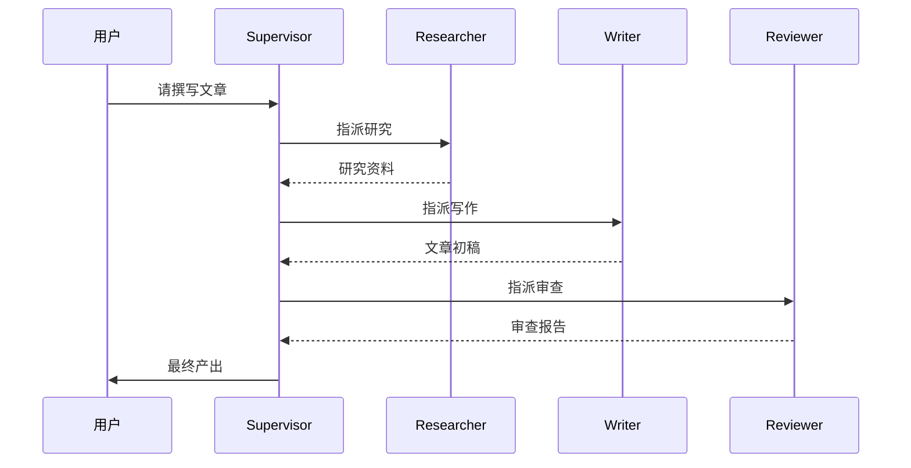

# Day 43: 多 Agent 系统

> **培训阶段**: 第四阶段 Agent 开发 | **第 7 周** | **学习时长**: 约 6-8 小时  
> **今日关键词**: Supervisor、多Agent协作、CrewAI、任务分配、Agent通信

---

## 📍 课程导航

### 上节回顾

**Day 42** 你掌握了 LangGraph 的生产级能力：Checkpoint 状态持久化、Human-in-the-loop 人工审核、Subgraph 子图模块化和并行节点执行。今天将这些能力扩展到**多 Agent 协作**——让多个专业 Agent 在 Supervisor 调度下协同完成复杂任务。

**Day 42 核心收获回顾：**
- MemorySaver + thread_id 实现会话持久化
- interrupt_before 在敏感操作前暂停
- Subgraph 封装可复用的 Agent 模块
- fan-out/fan-in 并行执行模式

### 本节学习目标

完成本日学习后，你将能够：

1. 理解多 Agent 系统的架构模式：Supervisor、Hierarchical、Collaborative
2. 用 LangGraph 实现 Supervisor 模式的多 Agent 编排
3. 掌握 Agent 间任务分配与结果传递机制
4. 了解 CrewAI 框架的基本用法与适用场景
5. 设计多 Agent 系统的错误处理与冲突解决策略
6. 为 Day 48 阶段项目三的多 Agent 架构做准备

### 与后续课程的衔接

- **Day 44** MCP 协议将标准化 Agent 与外部工具的连接，每个 Agent 可对接不同 MCP Server
- **Day 46** 多 Agent 的稳定性工程化：超时、重试、熔断
- **Day 48** 阶段项目三将采用 Supervisor + Worker 多 Agent 架构
- **Day 43** Supervisor 模式是工业界最常用的多 Agent 架构，必须熟练掌握

---

## 🌅 上午课程（9:00 - 12:00）

### 9:00 - 9:45 | 模块一：多 Agent 架构模式

#### 1.1 为什么需要多 Agent？

单个 Agent 面临三大瓶颈：

| 瓶颈 | 表现 | 多 Agent 解决方案 |
|------|------|-------------------|
| 工具过载 | >10 个工具时选择准确率骤降 | 每个 Worker 只配 2-3 个专用工具 |
| 能力单一 | 一个 Agent 难以同时擅长研究、写作、编码 | 专业分工，各展所长 |
| 上下文限制 | 复杂任务撑满上下文窗口 | 任务分段，各 Agent 处理子任务 |

```
单 Agent 模式（Day 39-42）：
  用户 → [一个 Agent + 10 个工具] → 结果
  问题：工具选择混乱，Prompt 臃肿

多 Agent 模式（今天）：
  用户 → [Supervisor] → 分析任务
              ├── [Research Agent] → 收集资料
              ├── [Writer Agent] → 撰写内容
              └── [Reviewer Agent] → 审查质量
              → 汇总 → 结果
```

#### 1.2 三种架构模式

**模式 1：Supervisor（主管模式）** ⭐ 最常用

```
         ┌──────────────┐
         │  Supervisor  │ ← 中央调度，决定下一步
         └──────┬───────┘
    ┌───────────┼───────────┐
    ▼           ▼           ▼
 Research    Writer     Reviewer
```

- 优点：控制力强，流程清晰
- 缺点：Supervisor 是单点，增加延迟
- 适用：任务可明确分解的场景

**模式 2：Hierarchical（层级模式）**

```
    ┌──────────────┐
    │  总 Supervisor │
    └──────┬───────┘
    ┌──────┴───────┐
    ▼              ▼
 技术主管        内容主管
    │              │
  ┌─┴─┐          ┌─┴─┐
  Coder Tester  Writer Editor
```

- 适用：大型项目，需要多级管理

**模式 3：Collaborative（协作模式）**

```
  Agent A ←→ Agent B
     ↕          ↕
  Agent C ←→ Agent D
```

- 适用：头脑风暴、创意生成
- 缺点：难以控制，容易发散

#### 1.3 多 Agent 设计原则

1. **单一职责**：每个 Agent 只做一件事
2. **清晰接口**：Agent 间通过结构化消息通信
3. **有限工具**：每个 Worker 不超过 3-5 个工具
4. **Supervisor 轻量**：Supervisor 不执行具体任务，只做路由
5. **失败隔离**：一个 Worker 失败不影响其他 Worker

---

### 9:45 - 10:30 | 模块二：LangGraph Supervisor 实现

#### 2.1 完整 Supervisor 代码

```python
# day43/supervisor_agent.py
"""
Supervisor 模式多 Agent 系统
"""
import os
from typing import Literal
from langchain_openai import ChatOpenAI
from langchain_core.messages import HumanMessage, SystemMessage, AIMessage
from langchain_core.tools import tool
from langgraph.graph import StateGraph, START, END, MessagesState
from langgraph.prebuilt import create_react_agent

llm = ChatOpenAI(
    model="deepseek-chat",
    api_key=os.getenv("DEEPSEEK_API_KEY"),
    base_url="https://api.deepseek.com",
    temperature=0,
)

# ===== Worker 工具 =====
@tool
def web_research(query: str) -> str:
    """搜索网络获取研究资料。"""
    mock_data = {
        "ai": "2026年AI趋势：Agent技术爆发，多模态融合加速。",
        "python": "Python持续主导AI开发，异步编程成为标配。",
    }
    for k, v in mock_data.items():
        if k in query.lower():
            return v
    return f"关于'{query}'的研究资料：暂无详细数据，建议换个关键词。"

@tool
def write_content(topic: str, research: str) -> str:
    """根据研究资料撰写内容。"""
    return f"""# {topic}

## 概述
基于最新研究，{topic}正在快速发展。

## 详细分析
{research}

## 结论
{topic}的未来值得期待，建议持续关注。
"""

@tool
def review_content(content: str) -> str:
    """审查内容质量。"""
    word_count = len(content)
    score = min(100, word_count // 5)
    return f"审查结果：字数{word_count}，质量评分{score}/100。建议：补充具体案例。"

# ===== Worker Agents =====
research_agent = create_react_agent(llm, [web_research])
writer_agent = create_react_agent(llm, [write_content])
reviewer_agent = create_react_agent(llm, [review_content])

# ===== Supervisor =====
WORKERS = ["researcher", "writer", "reviewer"]

def supervisor_node(state: MessagesState) -> dict:
    """Supervisor：分析当前状态，决定下一个 Worker"""
    system = f"""你是项目主管。根据当前任务进度，选择下一个执行的团队成员。

团队成员：
- researcher: 负责搜索和研究资料
- writer: 负责根据资料撰写内容
- reviewer: 负责审查内容质量
- FINISH: 所有工作完成，输出最终结果

规则：
1. 新任务先派 researcher 收集资料
2. 有研究资料后派 writer 撰写
3. 有初稿后派 reviewer 审查
4. 审查通过后返回 FINISH

只返回一个名称（researcher/writer/reviewer/FINISH）。"""
    
    messages = [SystemMessage(content=system)] + state["messages"]
    response = llm.invoke(messages)
    return {"messages": [AIMessage(content=f"[Supervisor] 指派: {response.content}")]}

def route_to_worker(state: MessagesState) -> str:
    """解析 Supervisor 决策，路由到对应 Worker"""
    last = state["messages"][-1].content.lower()
    if "finish" in last or "完成" in last:
        return "FINISH"
    if "research" in last:
        return "researcher"
    if "writ" in last:
        return "writer"
    if "review" in last:
        return "reviewer"
    return "researcher"  # 默认先研究

# ===== 构建图 =====
graph = StateGraph(MessagesState)

graph.add_node("supervisor", supervisor_node)
graph.add_node("researcher", research_agent)
graph.add_node("writer", writer_agent)
graph.add_node("reviewer", reviewer_agent)

graph.add_edge(START, "supervisor")
graph.add_conditional_edges("supervisor", route_to_worker, {
    "researcher": "researcher",
    "writer": "writer",
    "reviewer": "reviewer",
    "FINISH": END,
})

# Worker 完成后回到 Supervisor
for worker in ["researcher", "writer", "reviewer"]:
    graph.add_edge(worker, "supervisor")

app = graph.compile()

# ===== 运行 =====
if __name__ == "__main__":
    result = app.invoke({
        "messages": [HumanMessage(content="请撰写一篇关于2026年AI发展趋势的文章")]
    })
    
    print("=" * 60)
    for msg in result["messages"]:
        prefix = msg.__class__.__name__[:4]
        content = msg.content[:200] if msg.content else str(msg.tool_calls)
        print(f"[{prefix}] {content}")
        print("-" * 40)
```

#### 2.2 执行流程分析

```
用户: "撰写2026年AI发展趋势文章"
  │
  ▼
Supervisor: "指派 researcher" → Research Agent 搜索资料
  │
  ▼
Supervisor: "指派 writer" → Writer Agent 根据资料撰写
  │
  ▼
Supervisor: "指派 reviewer" → Reviewer Agent 审查质量
  │
  ▼
Supervisor: "FINISH" → 输出最终结果
```

---

### 10:30 - 10:45 | 课间休息

---

### 10:45 - 12:00 | 模块三：CrewAI 框架

#### 3.1 CrewAI 快速上手

```bash
pip install crewai crewai-tools
```

```python
# day43/crewai_demo.py
from crewai import Agent, Task, Crew, Process

researcher = Agent(
    role="高级行业研究员",
    goal="深入研究给定主题，收集全面准确的资料和数据",
    backstory="你拥有10年科技行业研究经验，擅长发现趋势和洞察",
    verbose=True,
    allow_delegation=False,
)

writer = Agent(
    role="资深内容作家",
    goal="将研究资料转化为结构清晰、引人入胜的文章",
    backstory="你是一位获奖科技专栏作家，擅长把复杂概念讲清楚",
    verbose=True,
    allow_delegation=False,
)

reviewer = Agent(
    role="内容质量审查员",
    goal="审查文章质量，确保准确性和可读性",
    backstory="你是一位严谨的内容编辑，对质量有极高要求",
    verbose=True,
    allow_delegation=False,
)

research_task = Task(
    description="深入研究'2026年大模型Agent技术'的发展现状和趋势",
    expected_output="一份包含关键数据、趋势分析、主要玩家的500字研究报告",
    agent=researcher,
)

write_task = Task(
    description="基于研究报告，撰写一篇面向技术爱好者的科普文章",
    expected_output="一篇800字左右、结构清晰、通俗易懂的科普文章",
    agent=writer,
    context=[research_task],
)

review_task = Task(
    description="审查文章的质量、准确性和可读性，给出修改建议",
    expected_output="审查报告：质量评分、具体问题、修改建议",
    agent=reviewer,
    context=[write_task],
)

crew = Crew(
    agents=[researcher, writer, reviewer],
    tasks=[research_task, write_task, review_task],
    process=Process.sequential,
    verbose=True,
)

result = crew.kickoff()
print(result)
```

#### 3.2 框架选型指南

| 维度 | LangGraph Supervisor | CrewAI |
|------|---------------------|--------|
| 灵活度 | ⭐⭐⭐⭐⭐ 完全自定义图 | ⭐⭐⭐ 预设 Process 模式 |
| 学习曲线 | 较高 | 较低 |
| 可视化 | Mermaid 图 | 内置 verbose 输出 |
| 状态管理 | Checkpoint 持久化 | 内存（无持久化） |
| 人工介入 | interrupt 原生支持 | 不原生支持 |
| 生产就绪 | ✅ 推荐 | 快速原型 |
| 本课程 | ✅ 主力框架 | 了解即可 |

---

## 🌇 下午实操（14:00 - 17:30）

### 14:00 - 15:30 | 实操项目：内容生产流水线

#### 项目需求

构建完整的内容生产流水线：

1. **Research Agent**：搜索主题资料
2. **Writer Agent**：撰写文章初稿
3. **Reviewer Agent**：审查并给出修改建议
4. **Supervisor**：协调整体流程
5. **日志记录**：记录每个 Agent 的执行过程

#### 增强版代码

```python
# day43/content_pipeline.py
"""
内容生产流水线 - 带日志和错误处理
"""
import os
import json
from datetime import datetime
from langchain_openai import ChatOpenAI
from langchain_core.messages import HumanMessage, SystemMessage, AIMessage
from langchain_core.tools import tool
from langgraph.graph import StateGraph, START, END, MessagesState
from langgraph.prebuilt import create_react_agent
from langgraph.checkpoint.memory import MemorySaver

llm = ChatOpenAI(
    model="deepseek-chat",
    api_key=os.getenv("DEEPSEEK_API_KEY"),
    base_url="https://api.deepseek.com",
    temperature=0,
)

# 执行日志
pipeline_log = []

def log_step(agent: str, action: str, detail: str = ""):
    entry = {
        "timestamp": datetime.now().isoformat(),
        "agent": agent,
        "action": action,
        "detail": detail[:200],
    }
    pipeline_log.append(entry)
    print(f"[{entry['timestamp'][:19]}] {agent}: {action}")

# 工具定义（同上午，此处省略重复代码）
@tool
def web_research(query: str) -> str:
    """搜索网络获取研究资料。"""
    log_step("researcher", "search", query)
    return f"关于'{query}'的研究：Agent技术2026年预计增长300%。"

@tool
def write_content(topic: str, research: str) -> str:
    """根据研究资料撰写内容。"""
    log_step("writer", "write", topic)
    return f"# {topic}\n\n{research}\n\n## 结论\n未来可期。"

@tool
def review_content(content: str) -> str:
    """审查内容质量。"""
    log_step("reviewer", "review", f"{len(content)}字")
    return f"审查通过，质量评分 85/100。"

# 构建 Supervisor 图（同上午结构）
research_agent = create_react_agent(llm, [web_research])
writer_agent = create_react_agent(llm, [write_content])
reviewer_agent = create_react_agent(llm, [review_content])

def supervisor_node(state: MessagesState) -> dict:
    system = """你是内容生产主管。根据进度选择下一个成员：
    researcher(研究) → writer(写作) → reviewer(审查) → FINISH(完成)
    只返回成员名称。"""
    response = llm.invoke([SystemMessage(content=system)] + state["messages"])
    decision = response.content.strip()
    log_step("supervisor", "decide", decision)
    return {"messages": [AIMessage(content=f"[Supervisor] → {decision}")]}

def route(state: MessagesState) -> str:
    last = state["messages"][-1].content.lower()
    for key in ["finish", "research", "writ", "review"]:
        if key in last:
            return {"finish": "FINISH", "research": "researcher",
                    "writ": "writer", "review": "reviewer"}[key]
    return "researcher"

graph = StateGraph(MessagesState)
graph.add_node("supervisor", supervisor_node)
graph.add_node("researcher", research_agent)
graph.add_node("writer", writer_agent)
graph.add_node("reviewer", reviewer_agent)

graph.add_edge(START, "supervisor")
graph.add_conditional_edges("supervisor", route, {
    "researcher": "researcher", "writer": "writer",
    "reviewer": "reviewer", "FINISH": END,
})
for w in ["researcher", "writer", "reviewer"]:
    graph.add_edge(w, "supervisor")

memory = MemorySaver()
app = graph.compile(checkpointer=memory)

def run_pipeline(topic: str, thread_id: str = "pipeline-1"):
    config = {"configurable": {"thread_id": thread_id}}
    log_step("system", "start", topic)
    
    result = app.invoke(
        {"messages": [HumanMessage(content=f"请为主题'{topic}'创作一篇文章")]},
        config=config,
    )
    
    # 保存日志
    with open(f"day43/pipeline_log_{thread_id}.json", "w") as f:
        json.dump(pipeline_log, f, ensure_ascii=False, indent=2)
    
    log_step("system", "complete", f"{len(pipeline_log)} steps")
    return result["messages"][-1].content

if __name__ == "__main__":
    topics = ["大模型Agent技术", "RAG检索增强生成", "模型微调实践"]
    for topic in topics:
        print(f"\n{'='*60}\n主题: {topic}\n{'='*60}")
        result = run_pipeline(topic, f"topic-{topics.index(topic)}")
        print(f"\n📄 最终产出:\n{result[:300]}...")
```

---

### 15:30 - 15:45 | 课间休息

---

### 15:45 - 17:30 | 扩展练习

#### 练习 1：添加第四个 Agent

```python
@tool
def seo_optimize(content: str, keywords: str) -> str:
    """SEO优化：调整标题、添加关键词。"""
    return f"[SEO优化] 已添加关键词: {keywords}"

seo_agent = create_react_agent(llm, [seo_optimize])
# 在 Supervisor 路由中添加 "seo" → seo_agent
```

#### 练习 2：Worker 失败重试

```python
class PipelineState(MessagesState):
    retry_count: int
    failed_agents: list

def supervisor_with_retry(state: PipelineState) -> dict:
    retries = state.get("retry_count", 0)
    if retries > 3:
        return {"messages": [AIMessage(content="[Supervisor] → FINISH (超过重试次数)")]}
    # ... 正常 Supervisor 逻辑
```

#### 练习 3：绘制协作时序图

为内容生产流水线画 Mermaid 时序图：



---

## 🌙 晚自习（19:00 - 21:00）

### 19:00 - 20:00 | 深度学习

1. LangGraph Supervisor 官方教程
2. CrewAI 文档：https://docs.crewai.com
3. 阅读 AutoGen 论文（选修）：微软的多 Agent 框架

### 20:00 - 21:00 | 自习答疑

- 完成内容生产流水线，测试 3 个主题
- 对比 LangGraph Supervisor 和 CrewAI 的输出质量
- Git 提交：`git commit -m "Day 43: 多Agent系统"`
- 预习 MCP 协议文档

---

## ✅ 今日知识清单

| 序号 | 知识点 | 掌握程度自评（1-5） |
|------|--------|---------------------|
| 1 | 多 Agent 系统的必要性与优势 | |
| 2 | Supervisor/Hierarchical/Collaborative 三种模式 | |
| 3 | LangGraph Supervisor 图设计与实现 | |
| 4 | Worker Agent 定义与工具隔离 | |
| 5 | Supervisor 路由函数编写 | |
| 6 | Agent 间消息传递机制 | |
| 7 | CrewAI Agent/Task/Crew 用法 | |
| 8 | LangGraph vs CrewAI 选型 | |
| 9 | 多 Agent 错误处理与重试 | |
| 10 | 内容生产流水线端到端实现 | |

---

## 📝 课后作业

### 必做题

1. **完成 Supervisor 多 Agent 系统**：3 个 Worker + Supervisor
2. **完成内容生产流水线**：测试 3 个不同主题
3. **编写协作时序图**：Mermaid 格式
4. **Git 提交**：推送 day43/ 到 GitHub

### 选做题

5. 用 CrewAI 实现同样的内容生产流水线，对比输出
6. 添加 SEO Agent 作为第四个 Worker
7. 实现 Worker 失败自动重试机制

---

## 💡 常见问题 FAQ

**Q1: 多 Agent 一定比单 Agent 好吗？**

A: 不一定。简单任务（查天气、算数学）用单 Agent 更稳定、更便宜。多 Agent 适合需要多种专业能力的复杂任务（内容生产、代码开发、数据分析）。

**Q2: Supervisor 会不会成为性能瓶颈？**

A: 每次路由都需要一次 LLM 调用，确实增加延迟。优化策略：(1) 用规则替代部分 LLM 路由；(2) 缓存常见任务的路由决策；(3) 并行执行无依赖的 Worker。

**Q3: Agent 之间如何传递上下文？**

A: 通过共享的 `MessagesState`。每个 Worker 的输出作为 `AIMessage` 追加到 messages 列表，后续 Worker 和 Supervisor 都能看到完整历史。

**Q4: CrewAI 能用于生产环境吗？**

A: CrewAI 适合快速原型验证。复杂生产场景推荐 LangGraph，因为支持 Checkpoint、interrupt、自定义图结构，控制力更强。

**Q5: 如何决定拆分为几个 Agent？**

A: 按专业能力拆分，每个 Agent 对应一个明确的角色（研究、写作、审查）。一般 3-5 个 Agent 为宜，太多会增加协调成本和出错概率。

---

## 🔮 明日预习

**Day 44: MCP 与 Agent 生态**

明天你将学习：

- MCP（Model Context Protocol）协议原理与架构
- 用 Python 开发 MCP Server
- MCP Server 与 LangChain Agent 集成
- Agent 生态全景：LangChain、CrewAI、AutoGen、Dify
- 在 Cursor 中配置和使用 MCP Server

**预习建议**：
1. 浏览 https://modelcontextprotocol.io 官网
2. 思考：今天 Worker Agent 的工具，能否封装为 MCP Server 供其他应用使用？
3. 安装：`pip install mcp`

---

*课程讲义 · 零基础大模型应用开发 70 天培训 · Day 43 · 第四阶段 Agent 开发*
